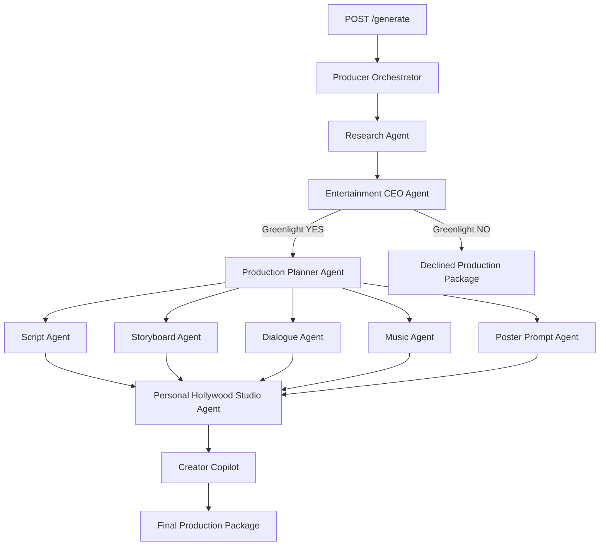

# ProducerGPT

> An Autonomous Hollywood Studio powered by AI Agents.

ProducerGPT is a backend-first FastAPI project for the **Autonomous Creative Agents** theme. A caller submits one movie idea; the Producer Orchestrator independently runs research, commercial evaluation, production planning, parallel creative departments, studio synthesis, and creator-facing finishing advice.

It is an autonomous workflow, not a chatbot. There is no database and no agent framework dependency.

## Features

- Autonomous multi-agent production workflow with a CEO greenlight gate
- Concurrent script, storyboard, dialogue, music, and poster generation
- Structured production package with creative assets and creator guidance
- Agent execution timeline, workflow logs, and stage-level performance metrics
- Swagger UI plus a static hackathon demo at `http://127.0.0.1:8000/demo`
- Live OpenAI mode and deterministic mock mode for demos

## Architecture Diagram



The five creative departments run concurrently through `asyncio.gather()`. Each agent owns a system prompt in `backend/prompts/` and shares the same asynchronous `OpenAIService` instance.

## Agent Flow

1. Research Agent creates cultural, factual, emotional, and audience context.
2. Entertainment CEO Agent approves or declines the production package.
3. Production Planner Agent defines the downstream deliverables and risks.
4. Five creative agents execute concurrently through `asyncio.gather()`.
5. Personal Hollywood Studio Agent synthesizes department outputs.
6. Creator Copilot delivers editing, camera, subtitle, color, voice, and music recommendations.

Every `/generate` response includes `workflow`, `execution_timeline`, `workflow_logs`, and `metrics` for demo visibility.

## Requirements

- Python 3.12
- OpenAI API key for live generation

Install dependencies:

```powershell
py -3.12 -m venv .venv
.\.venv\Scripts\Activate.ps1
python -m pip install -r requirements.txt
```

## Environment Variables

Use `.env.example` as the repository-root configuration template:

```dotenv
OPENAI_API_KEY=
OPENAI_MODEL=gpt-4o-mini
OPENAI_TEMPERATURE=0.7
OPENAI_TIMEOUT_SECONDS=60
OPENAI_MAX_RETRIES=2
OPENAI_MOCK_MODE=false
LOG_LEVEL=INFO
```

`.env.example` provides a safe starting point with `OPENAI_API_KEY`, `OPENAI_MODEL`, and `MOCK_MODE`. `MOCK_MODE` and `OPENAI_MOCK_MODE` are both supported. Set either one to `true` for deterministic schema-shaped previews without provider requests. Never commit local credentials or API keys.

## How to Run

```powershell
uvicorn backend.app:app --reload --host 0.0.0.0 --port 8000
```

Open Swagger UI at `http://127.0.0.1:8000/docs`.

Open the hackathon demo at `http://127.0.0.1:8000/demo`.

## API Endpoints

| Method | Path | Purpose |
| --- | --- | --- |
| GET | `/` | Service metadata |
| GET | `/health` | Process and provider-mode health check |
| POST | `/generate` | Complete autonomous production workflow |
| POST | `/research` | Research specialist |
| POST | `/ceo` | Commercial greenlight specialist |
| POST | `/planner` | Production planning specialist |
| POST | `/script` | Screenplay-development specialist |
| POST | `/storyboard` | Visual-storyboard specialist |
| POST | `/dialogue` | Dialogue and localization specialist |
| POST | `/music` | Score-development specialist |
| POST | `/poster` | Campaign key-art specialist |
| POST | `/copilot` | Post-production recommendation specialist |

## Generate a Package

```powershell
$body = @{
    idea = "A movie about the rise of Shivaji Maharaj."
    language = "Marathi"
    target_market = "India and global diaspora"
    budget_range = "Mid-scale theatrical"
} | ConvertTo-Json

Invoke-RestMethod -Method Post -Uri http://127.0.0.1:8000/generate `
    -ContentType "application/json" -Body $body
```

The response includes structured fields for `title`, `logline`, `genre`, `budget`, `audience`, `research`, `ceo`, `planner`, `creative_assets`, `creator_copilot`, `workflow`, `execution_timeline`, `workflow_logs`, and `metrics`. The original top-level creative fields remain available for existing API consumers.

## Workflow Behavior

- The CEO agent can return `greenlight: "NO"`; the workflow stops before creative generation and returns a `declined` package.
- Individual agent failures are logged and returned in `errors`; a workflow with non-critical failures returns `partial` rather than discarding completed work.
- Direct specialist endpoints return `503` when live generation is requested without `OPENAI_API_KEY`, and `502` for OpenAI provider failures.
- Prompt content and user input are treated as untrusted data, and agent prompts require JSON-object output.

## Project Layout

```text
backend/
  api/routes.py                 # FastAPI endpoints and dependencies
  orchestrator/producer.py      # Sequential gates and parallel fan-out
  agents/                       # One class per autonomous role
  services/openai_service.py    # Shared AsyncOpenAI wrapper
  models/                       # Pydantic request and response contracts
  prompts/                      # Agent-owned system prompts
    core/config.py                # Environment-backed settings
  app.py                         # ASGI application entry point
frontend/
    index.html                     # Static hackathon demo
    style.css                      # Dark demo UI
    script.js                      # Fetch-driven generation workflow
```

## Live Deployed Link

Open Live Link at `https://producergpt-1.onrender.com/demo/`.
